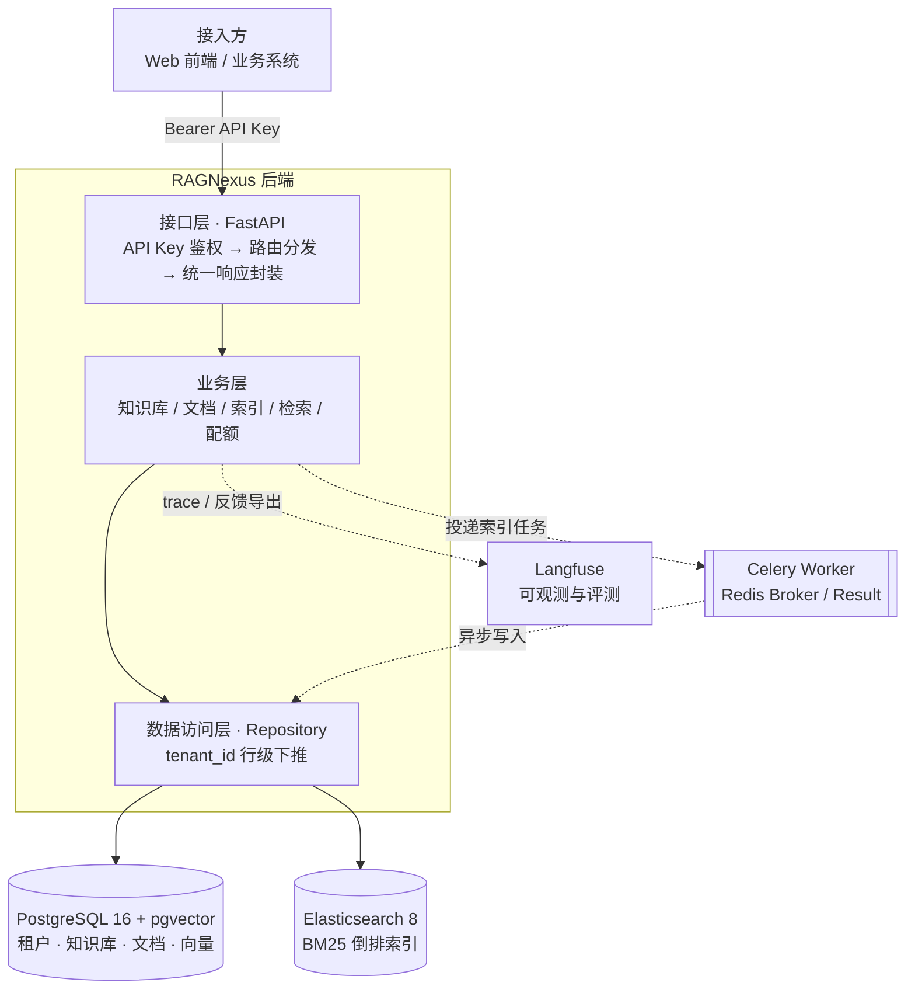

# RAGNexus 中台

> 面向多租户场景的**可复用 RAG 检索中台**。用一套 HTTP API 打通「知识库管理 → 文档异步索引 → 混合检索 → 离线评测」全链路，业务方无需自建向量库与检索链路。

<p>
  
  
  
  
  
</p>

---

## 解决什么问题

企业内部做知识问答时，常见困境是每业务线各建一套「上传文档 → 切块 → 存向量 → 检索」的链路：重复建设、租户隔离各写各的、配额与可观测缺位。

RAGNexus 把这类能力**收敛为一个中台**：接入方拿一个 API Key 接入，即获得独立的知识库、独立的向量与关键词索引、可切换的检索策略，以及受套餐约束的配额。检索质量通过**离线 Golden Set + RAGAS** 可回归、可对比。

## 核心能力

| 能力 | 说明 |
|------|------|
| 多租户隔离 | API Key（sha256 存储）鉴权 → 作用域校验 → 资源不存在统一返回 → `tenant_id` 行级查询下推 → Redis 配额，四道关卡 |
| 文档异步索引 | 上传即返回 `PROCESSING`，Celery + Redis 后台完成解析、切块、向量化与双写 |
| 混合检索 | pgvector 语义召回 + Elasticsearch BM25 倒排，RRF（k=60）融合排序 |
| 三档检索策略 | `speed` / `balanced` / `quality` 梯度配置，与租户套餐联动做能力开关 |
| 向量/文档一致性 | 向量随 PostgreSQL 事务挂起、ES 后写，成功才统一提交；失败整体回滚 + 任务重试 |
| 多格式解析 | Word（mammoth → HTML → Markdown + 清洗）、PDF（PyMuPDF 按页提取并标注页码），Provider 抽象可插拔 |
| 离线评测 | 人工标注 Golden Set + RAGAS `context_precision` / `context_recall`，支持从 Langfuse 低分反馈回流用例 |
| 可观测 | Langfuse 记录每次检索的 trace，支撑线上问题定位与评测用例导出 |

## 架构



## 技术选型

| 层级 | 选型 | 说明 |
|------|------|------|
| 接口层 | FastAPI | 原生异步、自动生成 OpenAPI 文档 |
| 业务/数据访问 | SQLAlchemy 2.0 + Repository | 业务逻辑与数据访问解耦，租户过滤统一收口 |
| 向量库 | PostgreSQL 16 + pgvector | 向量与业务数据**同源同事务**，复用 PG 的备份、权限与行级过滤能力 |
| 关键词检索 | Elasticsearch 8（ik 中文分词） | BM25 倒排，与向量各司其职形成两条独立召回通道 |
| 异步任务 | Celery + Redis | 索引任务解耦主请求链路，broker / result 分库（db 0 / 1） |
| Embedding / LLM | OpenAI 兼容 HTTP API | 不绑定厂商，DeepSeek / OpenAI / Ollama 均可 |
| 可观测 | Langfuse | 独立可观测平台，与业务框架解耦 |
| 前端 | React 18 + Vite + Tailwind | 知识库创建与批量文档上传界面 |

---

## 快速开始

### 前置要求

- Docker Desktop（需**先启动**，容器依赖它）
- Python 3.11+
- Node.js 18+（仅前端需要）

### 方式一：零 Key 演示（推荐先跑这个）

**不需要任何 Embedding / LLM API Key**，用内置的本地 mock 向量服务跑通全链路。

```bash
# 1. 构建带中文分词插件的 Elasticsearch 镜像（首次必做）
docker build -f Dockerfile.elasticsearch -t rag-center-elasticsearch:8.17.10-ik .

# 2. 启动基础设施：PostgreSQL + Elasticsearch + Redis + Langfuse
docker compose up -d

# 3. 安装依赖（建议用虚拟环境）
python -m venv .venv
.venv\Scripts\activate          # Windows
# source .venv/bin/activate     # macOS / Linux
pip install -e .

# 4. 建表
alembic upgrade head

# 5. 一键跑通：上传 → 异步索引 → 检索
python scripts/e2e_mock_demo.py
```

脚本会自动启动 mock embedding 服务、API 与 Celery Worker，然后完成「建租户 → 发 Key → 建库 → 上传文档 → 轮询索引状态 → 检索」全过程，并在终端打印检索命中的 chunk 与耗时。

预期能看到类似输出：

```
[speed]    mode=vector  vector_count=1  hits=1  ~600ms
[balanced] mode=hybrid  vector=1 bm25=1 fused=1  hits=1  ~830ms
```

> **Windows 提示**：Celery 在 Windows 上需使用 `--pool=solo`，演示脚本已自动处理。

### 方式二：接入真实模型

```bash
cp .env.example .env
```

编辑 `.env` 中至少以下几项：

```env
MODEL_BASE_URL=https://api.deepseek.com/v1
MODEL_API_KEY=你的key
EMBEDDING_MODEL=deepseek-embedding
EMBEDDING_DIMENSIONS=1536

LLM_BASE_URL=https://api.deepseek.com/v1
LLM_API_KEY=你的key
LLM_MODEL=deepseek-chat
```

> `EMBEDDING_DIMENSIONS` **必须**与模型实际输出维度一致；更换模型或维度后需清空并全量重建索引。

分别启动 API 与 Worker（需两个终端）：

```bash
# 终端 1
uvicorn app.main:app --reload --host 0.0.0.0 --port 8000

# 终端 2（Windows 追加 --pool=solo）
celery -A app.celery_app worker --loglevel=info
```

访问 <http://127.0.0.1:8000/docs> 查看 Swagger 文档。

**创建租户与 API Key**（平台侧开户，见「多租户与套餐」）：

```bash
python scripts/create_tenant.py --id tenant_demo --name "Demo Tenant"
python scripts/create_api_key.py --tenant-id tenant_demo --name "local dev"
# 明文 Key 只打印一次，请立即保存
```

未启动 Worker 时 upload 仍返回 `PROCESSING`，但索引不会执行。

### 前端（可选）

```bash
cd frontend
cp .env.example .env     # 填入 API_KEY
npm install
npm run dev              # http://127.0.0.1:5173
```

本地免 Key 调试：后端设 `AUTH_ENABLED=false`，前端 `API_KEY` 留空即可。

---

## 检索策略：三档 profile

`POST /api/v1/rag/retrieve` 通过 `profile` 选择策略，实际参数受租户套餐约束（超限返回 `20013` / `20014` / `20005`）：

| profile | 检索方式 | top_k | 典型套餐 |
|---------|----------|-------|----------|
| `speed` | 纯向量，最快 | 3 | free |
| `balanced` | hybrid（向量 + BM25 + RRF），**未传时默认** | 5 | standard / pro |
| `quality` | hybrid + LLM 重排 + query 改写 | 8 | pro |
| `custom` | 自行传 `retrieval_options` / `rerank_options` | 自定 | standard / pro |

```bash
curl -X POST http://127.0.0.1:8000/api/v1/rag/retrieve \
  -H "Authorization: Bearer rk_live_你的key" \
  -H "Content-Type: application/json" \
  -d '{
    "kb_id": "<kb_id>",
    "user_id": "user_demo",
    "query": "退款需要几天内申请？",
    "profile": "balanced"
  }'
```

**多库联合检索**：传 `kb_ids` 数组，各库并行召回后跨库 RRF 融合；每条 chunk 携带 `kb_id` / `kb_name`。一次多库 retrieve 仍计 1 次日检索量。套餐上限：free 单库、standard 3 库、pro 5 库。

响应 `metadata.retrieval` 会返回本次实际生效的 `mode` / `fusion` / 各路召回数量，`metadata.tenant_policy` 返回套餐与策略摘要，便于排查「为什么这次没走重排」。

### 知识库词表（query 扩展）

每个知识库可单独配置 `settings.synonyms`，检索前自动把业务术语补进 query，**不消耗 LLM**：

```bash
python scripts/update_kb_settings.py \
  --kb-id <kb_id> \
  --settings-file examples/kb_settings.example.json
```

命中时响应 `metadata.query_processing` 会返回 `search_query` 与 `synonym_expansions`。

---

## 多租户与套餐

**租户开通采用平台侧开户（provisioning）模式**，即由管理员通过脚本开通并发放密钥，不开放自助注册：

```bash
python scripts/create_tenant.py --id <tenant_id> --name "<显示名>"
python scripts/create_api_key.py --tenant-id <tenant_id> --name "<备注>"
python scripts/update_tenant_plan.py --tenant-id <tenant_id> --plan pro
```

设计理由：租户开通需同时绑定**套餐、配额与结算**关系，开放自助注册会把资源与风控敞口暴露给外部；接入方属于 B 端角色，走审批开户更可控。

**密钥生命周期**同样收在运维侧，不暴露公开接口：

```bash
# 查看某租户全部密钥（只读）
python scripts/revoke_api_key.py --tenant-id <tenant_id> --list

# 吊销：支持按 --key-id / --key-prefix / --name 定位，需 --yes 确认
python scripts/revoke_api_key.py --tenant-id <tenant_id> --key-prefix rk_a1b2 --yes

# 轮换：吊销旧密钥并签发同名新密钥（明文只打印一次）
python scripts/revoke_api_key.py --tenant-id <tenant_id> --key-prefix rk_a1b2 --rotate --yes

# 签发带有效期的密钥（不传 --expires-days 则永不过期）
python scripts/create_api_key.py --tenant-id <tenant_id> --name "prod" --expires-days 90
```

吊销即把 `api_keys.status` 置为 `revoked`；鉴权侧 `get_active_by_hash` 只认 `status=active` **且未过期**的密钥，二者任一不满足直接返回未授权。为避免把租户锁死，吊销最后一把有效密钥需显式加 `--force`，或用 `--rotate` 直接换发。

**隔离链路**（四道关卡）：

1. `Authorization: Bearer rk_live_xxx` → 取 `key_hash` 做 sha256 比对
2. 校验 API Key 状态与作用域
3. 资源不属于当前租户时统一返回「不存在」，不泄露其他租户信息
4. 所有查询带 `tenant_id` 条件下推，额度写入 Redis 计数

租户身份完全由 API Key 决定，请求体**无需**传 `tenant_id`。可先调用 `GET /api/v1/auth/me` 验证 Key 是否有效并查看当前套餐。

详见 [`docs/tenant-onboarding.md`](docs/tenant-onboarding.md)。

### 错误码

| code | 含义 | 典型场景 |
|------|------|----------|
| `20005` | 接口调用超限 | 秒级 QPS 超限 |
| `20013` | 当前套餐不支持该功能 | free 传 `profile=balanced`；standard 开 rerank；free 传多个 `kb_ids` |
| `20014` | 配额已用尽 | free 建第 2 个库；日检索量超限 |

---

## API 速查

所有接口前缀 `/api/v1`，响应统一为 `{"code": 0, "msg": "success", "data": {...}}`。

| 方法 | 路径 | 说明 |
|------|------|------|
| GET | `/auth/me` | 当前租户身份与套餐 |
| POST | `/knowledge-bases/create` | 创建知识库 |
| GET / PATCH / DELETE | `/knowledge-bases/{kb_id}` | 查详情 / 改名称描述词表 / 删库及文档 |
| POST | `/documents/upload` | 上传文档，异步索引 |
| GET | `/documents/{document_id}` | 查索引状态（`1=SUCCESS` `2=FAILED` `3=PROCESSING`） |
| POST | `/documents/{document_id}/reindex` | 重建索引（SUCCESS / FAILED 可用） |
| DELETE | `/documents/{document_id}` | 删除文档 |
| POST | `/rag/retrieve` | 检索（支持单库 / 多库、三档 profile） |

更多可执行示例见 [`curltest/`](curltest/)。

### 切块策略变更后需 reindex

切块规则变更只对**新上传**的文档生效，存量库需全量重建：

```bash
# 整库重建（需 Worker 运行）
python scripts/reindex_knowledge_base.py --kb-id <kb_id> --wait

# 指定单篇
python scripts/reindex_knowledge_base.py --kb-id <kb_id> --document-id <document_id> --wait
```

脚本会清理 pgvector / ES 中的旧 chunk，从 `documents.content` 重新索引，无需重新上传文件。

---

## 离线评测

改词表、改 profile 之前，先用固定 Golden Set 批量跑检索，用 RAGAS 输出 `context_precision` / `context_recall`，对比配置调整前后的分数。

```bash
# 安装评测依赖
pip install -e ".[eval]"

# 跑主集回归
python scripts/run_retrieval_eval.py \
  --dataset eval/datasets/ecommerce_retrieval.json \
  --api-key rk_live_你的key \
  --profile balanced \
  --output eval/reports/balanced.json
```

**评测集来源**：人工标注为主（`eval/datasets/`），并从 Langfuse 把线上低分反馈回流成新用例：

```bash
python scripts/export_eval_cases_from_langfuse.py \
  --max-score 3 --days 30 --kb-id <kb_id> \
  --output eval/datasets/imported_from_feedback.json
```

回流用例的 `ground_truth` 为空，需人工补标注后再纳入回归集；`ground_truth` 为空的用例会被评测器自动跳过。

设计取舍：采用**离线固定集 + 单变量对比**，而非线上 A/B。原因是检索链路改动粒度小、线上流量分散，离线集能保证可复现与可回归，避免被线上噪声干扰；反馈回流则解决了「离线集脱离真实场景」的问题。

---

## 项目结构

```
rag-center/
├── app/
│   ├── api/v1/            # 路由与依赖注入
│   ├── core/              # 配置、日志、鉴权、异常、中间件
│   ├── models/            # SQLAlchemy 模型（租户 / API Key / 知识库 / 文档 / chunk）
│   ├── repositories/      # 数据访问层，统一租户过滤
│   ├── providers/         # 适配层：embedding / llm / rerank / vectorstore / keyword_search / parsers
│   ├── services/          # 业务逻辑：知识库、文档、索引、检索、配额、RRF 融合
│   ├── tenant/            # 套餐与检索档位预设
│   └── tasks/             # Celery 任务
├── frontend/              # React 前端
├── migrations/            # Alembic 迁移
├── eval/                  # Golden Set 与评测报告
├── scripts/               # 运维 / 演示 / 评测脚本
├── curltest/              # curl 示例
├── docs/                  # 补充文档
├── docker-compose.yml     # PostgreSQL + Elasticsearch + Redis + Langfuse
└── Dockerfile.elasticsearch
```

## 开发

```bash
pip install -e ".[dev]"
ruff check .

# 修改模型后生成迁移
alembic revision --autogenerate -m "describe change"
alembic upgrade head
```

### 后端容器化部署

```bash
docker build -t rag-center .
docker run --env-file .env -p 8000:8000 rag-center
```

需保证容器内可访问 PostgreSQL 与 Elasticsearch（调整 `.env` 连接地址或使用同一 Docker 网络）。

---

## 已知边界

架构决策的取舍点，也是当前版本的明确不覆盖范围：

- **解析范围**：仅支持文本型 PDF 与 Word，**不含 OCR**，扫描件与纯图片 PDF 无法提取内容。
- **租户隔离**：基于应用层鉴权 + `tenant_id` 查询下推，**未启用 PostgreSQL RLS 行级安全**。当前规模下应用层收口更易调试；多租户规模扩大后可叠加 RLS 做纵深防御。
- **写入一致性**：向量与 ES 为**最终一致**，非分布式事务。顺序为「向量写入挂起（不提交）→ 写 ES → 成功才统一 commit」，任一步失败整体 rollback 并标记失败，靠任务重试与新事务整篇重跑补偿。
- **租户开通**：仅提供平台侧脚本开户，无自助注册 API；密钥的查看/吊销/轮换同样走脚本（`revoke_api_key.py`），未提供公开管理接口。
- **密钥审计**：`status` 变更为就地更新，**未记录 `revoked_at` 时间戳**；若需审计密钥吊销时间，需新增字段并补迁移。
- **编排方式**：检索链路是固定 pipeline，未引入 LangGraph 等图编排框架；固定链路在延迟与可预测性上更可控。
- **评测规模**：Golden Set 为人工标注的小规模集合，用于回归对比而非统计显著性验证。
